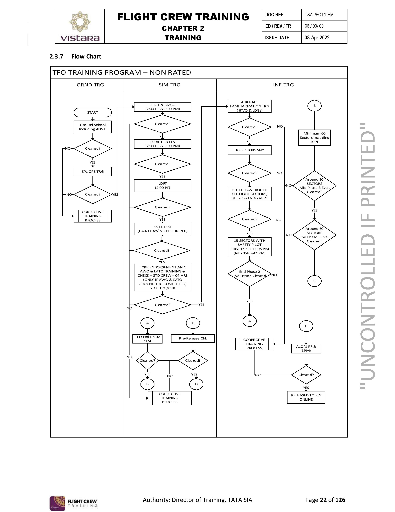

## 🗂️ Project: Flight Crew Training Process Mapping – Vistara Airlines

### Overview
This project involved the end-to-end mapping of all core and supporting processes within the Flight Crew Training (FCT) department at Vistara. Using BPMN standards in Microsoft Visio, the workflows were collaboratively developed with multiple departments including HR, FOPS, and CLTSC.

### Key Contributions
- 🛠️ Created detailed BPMN diagrams for training workflows (e.g., pilot recruitment, onboarding, simulator assessments, license validation).
- 📘 Developed the **Department Procedures Manual (DPM)**, aligning with regulatory standards and operational manuals (OM-D).
- 🤝 Facilitated cross-functional workshops to validate and finalize processes.
- 📄 Final output served as a reference guide for 3+ subsequent departmental projects.

### Tools & Standards
- **Microsoft Visio** – BPMN 2.0 Process Mapping
- **Adobe Framemaker** – DPM Documentation
- **Aviation SOPs** – OM-D, DGCA Guidelines

### Impact
- ✅ Improved clarity in roles and responsibilities
- ✅ Streamlined compliance processes
- ✅ Enabled training continuity and knowledge transfer

### Process Visualisation
- Pilot training process visualisation
